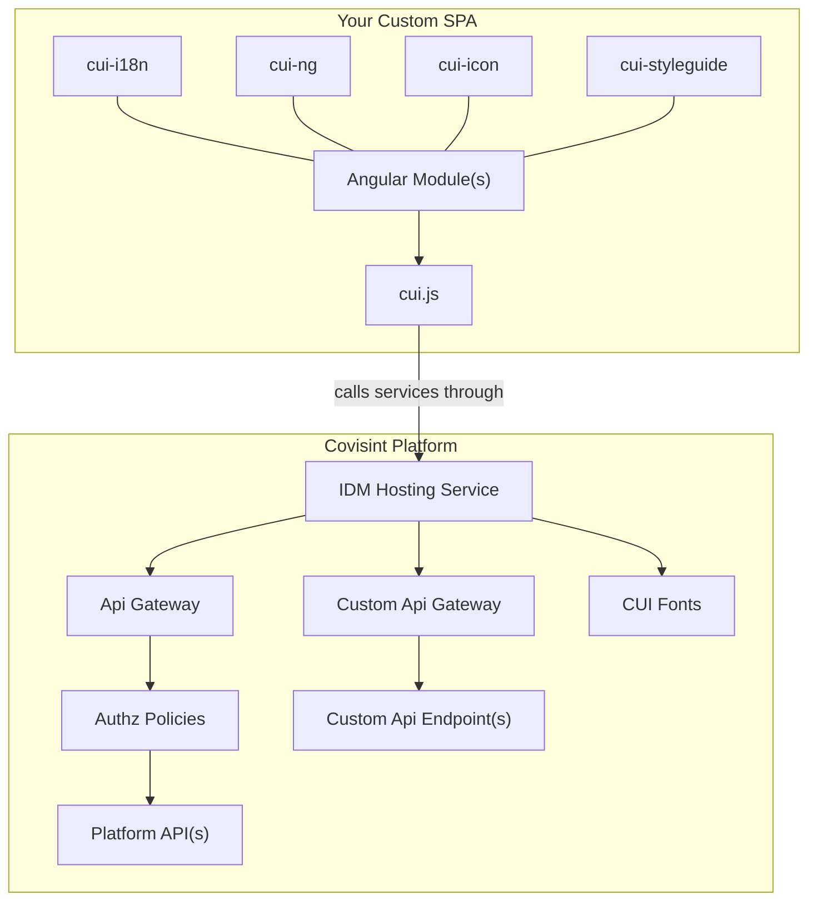
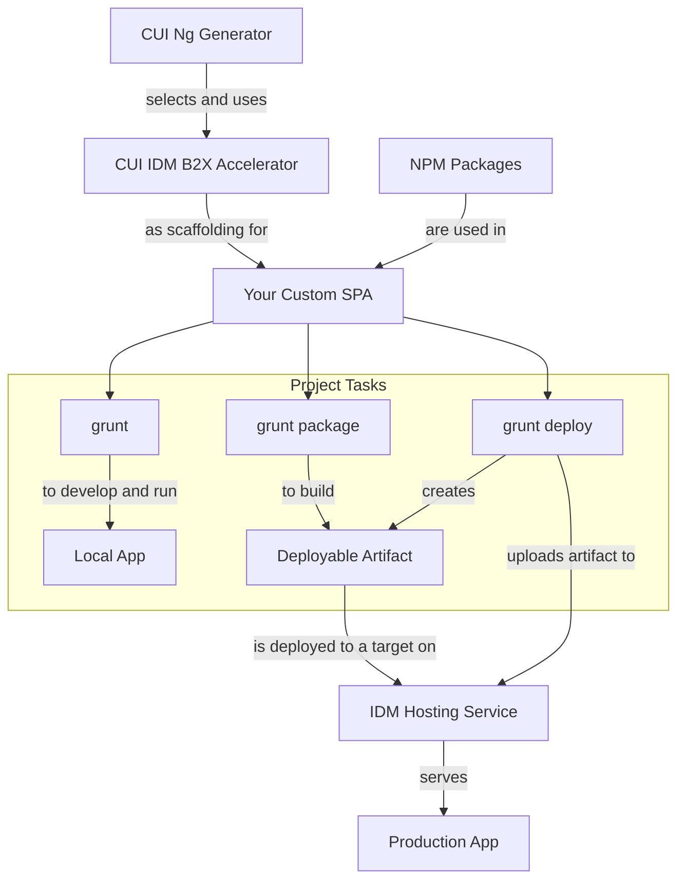

# Background

The CUI SDK was built to provide various components to assist in:

* Developing a frontend UI
* Integrating various brand styling to the UI
* Connecting it to the Covisint Platform Services.

## High Level Architecture

## Development Workflow

