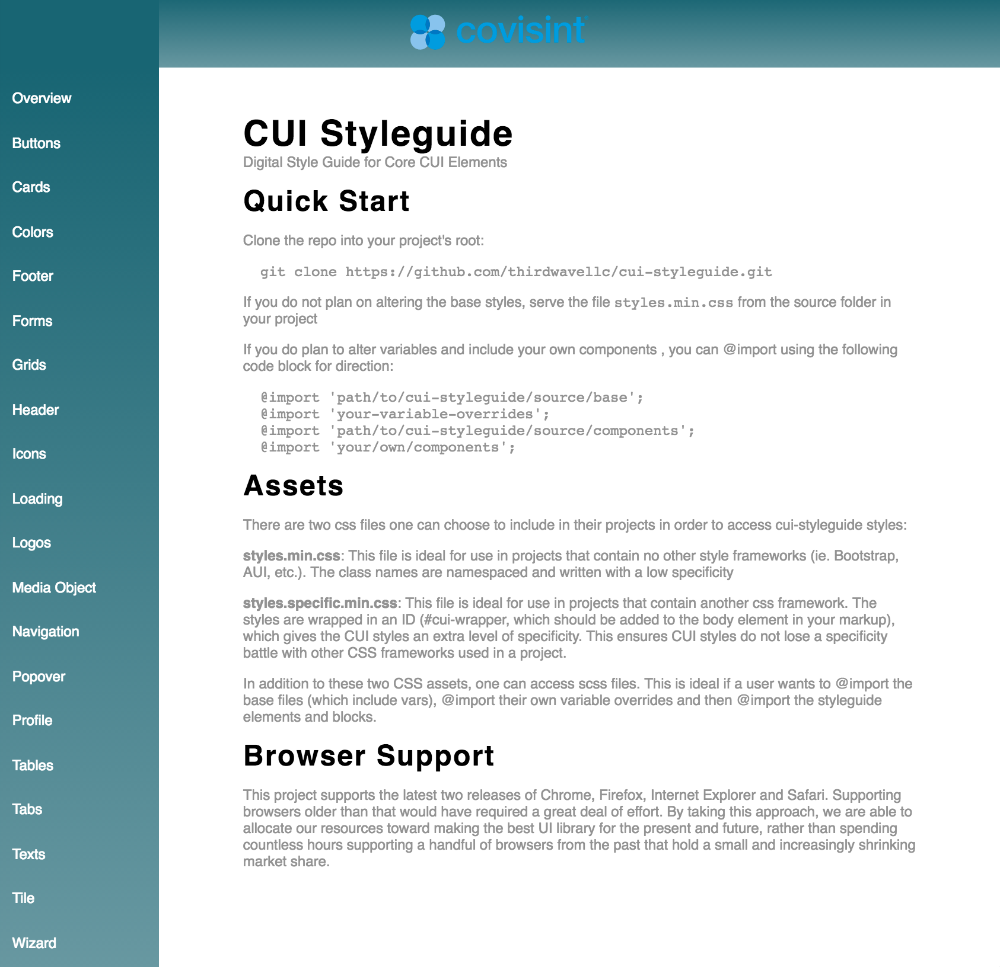

# CUI Styleguide

Version 2.5.0

[Repository & Readme](https://github.com/covisint/cui-styleguide) \| [Style Guide](http://cui-styleguide.run.covisintrnd.com)

## Description

A Style source for all components used in the CUI framework. This styleguide utilizes KSS [kss-node specifically](https://github.com/kss-node/kss-node) to generate documentation for designers, developers and others to use as a catalogue reference for the look and feel of CUI.

## Customization

Rather than forking this styleguide and modifying to your needs, you can customize existing component properties through variables available in [source\/scss\/base\/\_vars.scss](https://github.com/covisint/cui-styleguide/tree/master/source/scss/base/_vars.scss). A visual explanation for different variable names can be found in the [variables](variables.md) section as well.

In order to alter these variables in your project, please refer to the Style Guide's Quick Start section.

## Browser Support

This project supports the latest two releases of Chrome, Firefox, and Safari. In addition, we support IE11 and Edge. Supporting browsers older than that would have required a great deal of effort. By taking this approach, we are able to allocate our resources toward making the best UI library for the present and future, rather than spending countless hours supporting a handful of browsers from the past that hold a small and increasingly shrinking market share.

## The Style Guide Reference Site

